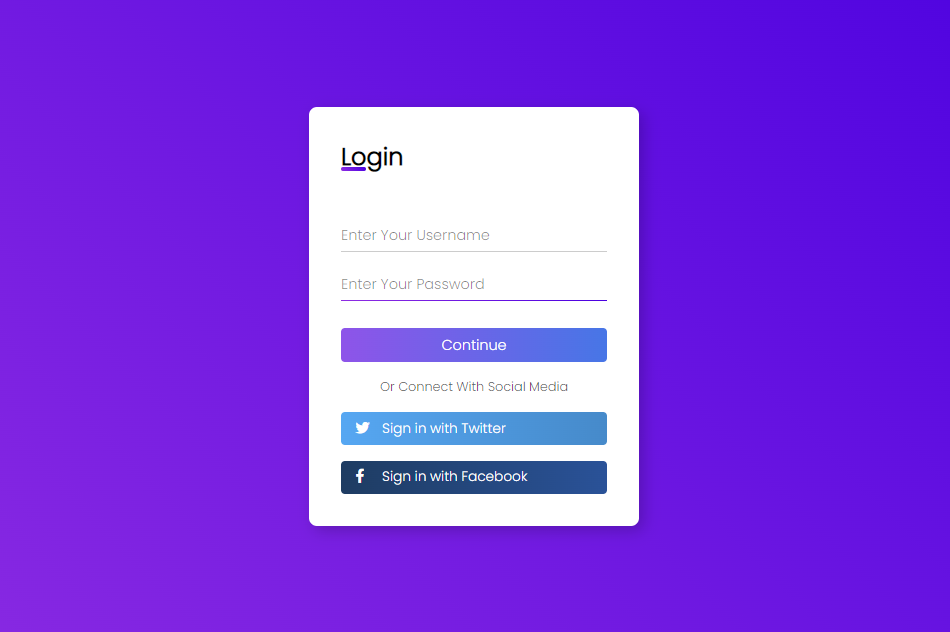

# Login Form

Sample simple and responsive login form made with HTML and CSS using transitions.

</br>

### Final Result

</br>
</br>
</br>

## 🚀 Starting
</br>

```

git clone https://github.com/leandro-SI/login-form

To start the project, just open the file `index.html` in your preferred browser.

```

